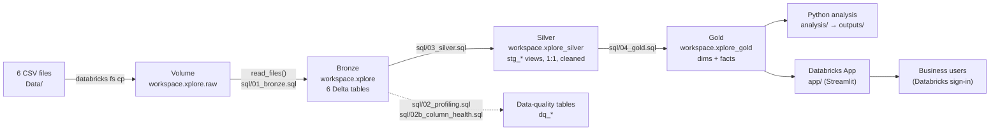

# Technical Call Spike: Root-Cause Analysis on Databricks

Take-home assessment (Intelligence Analytics Engineer). Technical support calls jumped from **80 to ~148 a day
(+85%) overnight on 26 May 2026** and stayed high. This repository holds the full analysis: a medallion data model in
Databricks (Unity Catalog), the Python analysis behind every number, and a multipage **Databricks App** that lets a
business user explore what happened, what drove it, why, what customers say and what to monitor.

All data is the synthetic dataset provided with the assessment. Every assumption is labelled
(see [Assumptions and data gaps](#assumptions-and-data-gaps)).

## Deliverables

| # | Deliverable | Where |
|---|---|---|
| 1 | Executive deck, 3 slides (what and when · why · what to do) | `deliverables/Executive_Deck.pdf` |
| 2 | Databricks App `call-spike-monitor` | Live: https://call-spike-monitor-7474647701694312.aws.databricksapps.com (see [Viewing the app](#viewing-the-app)) · walkthrough with screenshots: [`deliverables/App_Walkthrough.pdf`](deliverables/App_Walkthrough.pdf) ([screenshots](deliverables/screenshots/)) · code: [`app/`](app/) |
| 3 | AI Usage Note (1 page) | [`deliverables/AI_Usage_Note.pdf`](deliverables/AI_Usage_Note.pdf) · full record: [`docs/AI_workflow.md`](docs/AI_workflow.md) |

## Answers to the leadership questions

Volume and timing come from the true daily totals (`call_volume_daily`). Call mix, repeats and customer voice come
from the call-level table, which was provided as a ~10% sample of all calls and is re-weighted to the true daily
totals, comparing **pre-spike (1–25 May) with post-spike (June)** (see [Method](#method)).

| Question | Answer |
|---|---|
| **Q1** Did technical calls increase? | Yes: **80 → 148 calls a day (+85%)**, about 2,456 extra calls between 26 May and 30 June. |
| **Q2** When did it start? | **26 May, overnight** (80 → 146 on day one), and it has not come down. |
| **Q3** What contributed most? | **“No Internet” (10 → 40 a day) and “Slow Speed” (13 → 38 a day) make up 81.5% of the increase**; their share of calls rose from 28% to 53%. Every region, platform, product and segment rose roughly in proportion. |
| **Q4** What is the likely root cause? | **Two suspects, neither proven.** (1) **Firmware 3.8.1**: the 120 devices on it reboot 12× a week (vs 2 on 3.7.4) and all have weak signal; the jump came 1–4 days after the Ontario (22 May) and Prairies (25 May) updates. (2) **A nationwide change**: BC and Atlantic had no update yet kept their share of calls (35% → 33%; it would be 19% if only updated provinces were hit), and there was no second jump after Quebec's 2 June update. Confidence: what / when / how much = high; cause = low to medium. |
| **Q5** Are repeat contacts amplifying it? | Yes: the repeat rate rose from **13% to 29%**, about **23 extra calls a day** (roughly a third of the increase). Follow-ups doubled (9% → 19%); calls resolved on the call stayed at ~15%. |
| **Q6** What are the customer pain points? | Internet dropping (described as recurring), slow speed and buffering, problems not fixed first time. A June agent note (“regional instability, repeat contacts, frustration”) appears on every June connectivity call. CSAT is low (~3.3) with half of surveyed callers detractors, and **did not change** (+0.2 is within noise). |
| **Q7** What should we do? | **Confirm** the cause (rollback pilot on a sample of 3.8.1 devices · map firmware to every caller · audit the network change log for 1 Apr–30 Jun). **Contain** the volume (known-issue message on IVR, status page and app · proactive outreach to repeat callers · credits for repeat callers). **Monitor** recovery in the app (alert above 96 calls a day, i.e. 20% above normal · alert when repeats pass 18% · track unstable devices). At stake: agent workload doubled (21 → 44 hours a day). |
| **Q8** Databricks App | Built and deployed: see [The app](#the-app). |

Not measurable with the data provided: call rate per active customer, true technician dispatch rate, wait times,
cost and churn.

## Architecture



- **Bronze** (`workspace.xplore`): the six provided files as Delta tables, untouched, plus data-quality snapshots
  (`dq_data_dictionary`, `dq_schema_comparison`, `dq_table_summary`, `dq_column_health`) that compare the data with
  the data dictionary.
- **Silver** (`workspace.xplore_silver`): one `stg_*` view per bronze table. Renames, trims, type-safe booleans and
  simple row-level flags, no joins.
- **Gold** (`workspace.xplore_gold`): what the analysis and app read. Details in
  [`notes/data_model.md`](notes/data_model.md).

| Gold object | Grain | Used for |
|---|---|---|
| `fct_daily_volume` | 1 row per day (1 Apr–30 Jun), true totals | How much and when |
| `fct_calls` | 1 row per sampled call (750, May–Jun), with transcript and survey folded in | Who and what (mix, repeats, voice) |
| `dim_region` | 1 row per region, with its firmware-update event (if any) | Firmware timing and location |
| `dim_date` | 1 row per day | Calendar |
| `fct_device_health` | 1 row per device (200) | Firmware telemetry (standalone: device IDs do not match callers) |

The two facts are never joined to each other: they have different grains (sample vs true totals).

## Method

- **Sample re-weighting.** The data provides two views of the same calls: `call_volume_daily` has the true number of
  technical calls each day (7,336 in May–June), while `technical_calls` has details for only 750 of them. The call
  details arrived as a sample (we did not sample them), unevenly by period (about 6% of calls on 1–25 May, 4% on
  26–31 May, 13% in June). Each sampled call gets
  *weight = true calls that day ÷ sampled calls that day*, so unfiltered weighted totals reproduce
  `call_volume_daily` exactly and every breakdown is an estimate of real calls.
- **Periods.** The spike starts on 26 May (first day clearly above the flat baseline of 80 and staying there).
  Daily totals compare 1 Apr–25 May with 26 May–30 Jun. Call-level comparisons use **1–25 May vs June**: the 34
  sampled calls for 26–31 May still look like normal May (connectivity 29%, repeats 9%, no June agent note) although
  volume had already doubled, so they are left out of mix comparisons (assumption A19).
- **Noise check.** Small samples can produce large swings, so the app counts a change only if it is bigger than two
  standard errors (the sampling error). It needs at least 10 sampled calls (10 surveys for CSAT) on each side, and
  results resting on 10–29 are marked “small sample” (direction clear, size approximate); otherwise it says “Within
  noise” or “Too few calls to tell”. For example, CSAT moved 3.18 → 3.35 company-wide, within a noise band of ±0.33
  (“Within noise”), while No Internet calls rose by 30 a day against a band of ±8 (clearly real, small sample).
- **Directional, not inferential.** As the brief asks, the analysis is evidence-based and directional; no heavy
  statistics beyond the noise check above.

## Assumptions and data gaps

The full register (A1–A21) is in [`notes/assumptions.md`](notes/assumptions.md); evidence (F01–F38) is in
[`notes/findings.md`](notes/findings.md). The ones that shape the answers:

| | Gap or assumption | How it is handled |
|---|---|---|
| A1 | `customer_base_daily` not provided | No call rate per customer; raw volumes reported |
| A2 | `truck_rolls` not provided | Calls ending in “Technician scheduled” used as a labelled proxy |
| A3 | `technical_calls` has no firmware version, modem or event link | Firmware linked to calls by region and date only; the app's firmware filter is a region-level proxy |
| A4 | `device_health` customer IDs match 0 of 750 callers | Device telemetry used only as a standalone firmware comparison |
| A17 | The call table is an uneven, month-stratified sample | Volumes and timing only from daily totals; mix via re-weighting |
| A19 | 26–31 May call records look like May | Call-level comparisons use 1–25 May vs June |
| A20 | `network_events` has no firmware column | “The updates installed 3.8.1” is a labelled assumption |
| A21 | Platform / product labels behave like random draws | Platform is not used as an equipment proxy |
| | No network change log at all | Needed to test suspect 2; listed as the first data request |
| | `detected_theme` matches the call reason only at chance level (18% vs 17%); `ai_sentiment` copies `customer_sentiment` | Neither is used |

## The app

Multipage Streamlit app on Databricks Apps, reading the gold views through a SQL warehouse as the app's service
principal (read-only grants on `xplore_gold` and `xplore_silver`). Menu across the top, filters in the sidebar.

| Page | What it shows |
|---|---|
| **Summary** | One screen: headline, 4 key numbers as pre-spike → post-spike (each opens a before-vs-after pop-up), and cards linking to each page |
| **KPIs** | Status table of 8 KPIs (status, pre → post, change, weekly sparkline); tick a row or use “Open details for” for a pop-up chart |
| **Drivers** | Pre- vs post-spike calls by reason, region, firmware update, platform, product, segment, channel or outcome; click a bar to drill in; region × reason heatmap |
| **Root cause** | The two suspects with their evidence and the four data gaps that keep them hypotheses |
| **Voice** | Pain points per call reason; tick a row or use “Open details for” to read what those callers say |
| **Monitor** | Company-wide status as of 30 Jun: what's at stake, alert status with adjustable alert lines, daily and weekly charts |
| **Notes** | Method, proxies, exclusions |

How it meets the brief: 8 KPIs (calls per day, connection problems, repeat calls, follow-up needed, average call
duration, agent hours, technician visits [proxy], CSAT; negative sentiment per reason on Customer voice) · filters for
dates, region, firmware update in region, reason, platform, product, segment and channel · time series (KPIs,
Monitor) · root-cause and driver visuals (What drove it, Root cause) · region, product and firmware drilldown ·
short insight narrative on every page. Details in [`app/README.md`](app/README.md).

### Viewing the app

Databricks Apps cannot be made public: anyone opening the link must sign in to the workspace and be granted access.
On Databricks Free Edition an app also stops 24 hours after it was last started. Screenshots of every page, mapped to the brief's requirements, are in
[`deliverables/App_Walkthrough.pdf`](deliverables/App_Walkthrough.pdf), and a live walkthrough can be given on request.

## Validation

- **Automated app test** ([`app/test_app.py`](app/test_app.py), Streamlit AppTest on real data): every page under 12
  filter scenarios (including empty selections and single-period date ranges), every KPI and customer-voice pop-up,
  every drill-down, alert sliders, reset, and filters kept across pages.
- **Independent number audit:** an evaluation agent rebuilt every number and filter in the app with SQL written from
  scratch on the raw tables: 4,950 automated checks, 4,946 passed, no wrong number found
  ([`notes/app_test_report.md`](notes/app_test_report.md), scripts in [`qa/`](qa/)).
- **Two independent reviews** of the analysis ([`notes/solution_review.md`](notes/solution_review.md),
  [`notes/solution_review_sonnet.md`](notes/solution_review_sonnet.md)), compared and actioned in
  [`notes/review_comparison.md`](notes/review_comparison.md).
- **Analysis scripts carry their own checks** (e.g. `outputs/phase4/correctness_checks.csv`, `outputs/phase6/checks.csv`).

## Reproduce it

**Prerequisites:** a Databricks workspace (Free Edition is enough) with a SQL warehouse, the Databricks CLI ≥ 1.0
logged in (`databricks auth login --host <workspace-url> --profile <profile>`), Python 3.11.

1. **Load the data:** upload `Data/` to the volume and run [`sql/01_bronze.sql`](sql/01_bronze.sql).
2. **Profile it:** run [`sql/02_profiling.sql`](sql/02_profiling.sql) and [`sql/02b_column_health.sql`](sql/02b_column_health.sql).
3. **Build the model:** run [`sql/03_silver.sql`](sql/03_silver.sql), then [`sql/04_gold.sql`](sql/04_gold.sql).
   Each file can be pasted into the SQL editor, or run statement by statement with
   `databricks experimental aitools tools query "<SQL>" -p <profile>`.
4. **Run the analysis** (scripts read the gold views through the CLI; set `PROFILE` and `WAREHOUSE_ID` in
   [`analysis/db.py`](analysis/db.py)):
   ```bash
   python3.11 -m venv .venv && .venv/bin/pip install -r requirements.txt
   cd analysis && ../.venv/bin/python p3_trend.py      # Q1/Q2  → outputs/phase3/
   ../.venv/bin/python p4_drivers.py                   # Q3/Q5  → outputs/phase4/
   ../.venv/bin/python p5_region.py                    # Q4 location test → outputs/phase5/
   ../.venv/bin/python p6_voice.py                     # Q6     → outputs/phase6/
   ```
5. **Run, test and deploy the app:** see [`app/README.md`](app/README.md).

## Repository map

```
.
├── README.md                 this file
├── Data/                     the 6 provided CSV files (synthetic)
├── sql/                      01_bronze → 02 profiling → 03_silver → 04_gold
├── analysis/                 Python analysis (db.py = data access, style.py = chart style, p3–p6 = questions)
├── outputs/                  charts, tables and checks produced by analysis/
├── app/                      Databricks App (Streamlit): app.py, data.py, test_app.py, deploy config
├── deliverables/             executive deck, AI usage note, app screenshots
├── docs/                     AI_workflow.md: how AI was used and evaluated
├── qa/                       independent audit scripts and result tables
└── notes/                    working notes: findings, assumptions, data model, reviews, Q&A sheet, learning log
```

Useful notes: [`notes/qa_cheatsheet.md`](notes/qa_cheatsheet.md) (all answers with sources) ·
[`notes/findings.md`](notes/findings.md) · [`notes/assumptions.md`](notes/assumptions.md) ·
[`notes/root_cause_hypotheses.md`](notes/root_cause_hypotheses.md) · [`notes/learning_log.md`](notes/learning_log.md)
(decisions, prompts and AI corrections).

## Use of AI

The work was done with an AI coding assistant (Claude Code) as a pair: drafting SQL and Python, building the app,
and running independent evaluation agents on different models. Every number was checked against the data. The full
record (setup, `CLAUDE.md` rules, context management, models, evaluation agents, test scripts and corrections) is in
[`docs/AI_workflow.md`](docs/AI_workflow.md); the day-by-day log is [`notes/learning_log.md`](notes/learning_log.md).
